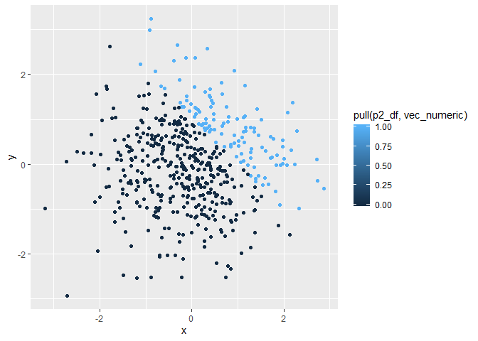
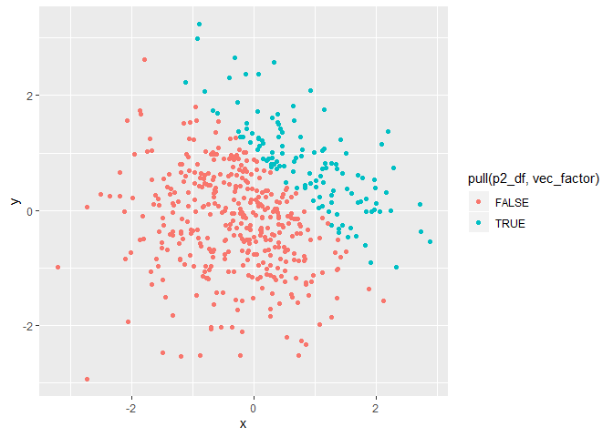

p8105\_hw1\_nl2655
================
Nankun

# Problem 1

## 1.1

``` r
library(tidyverse)
```

    ## -- Attaching packages -------------------------------------------------------------------------------------------------- tidyverse 1.2.1 --

    ## √ ggplot2 3.2.1     √ purrr   0.3.2
    ## √ tibble  2.1.3     √ dplyr   0.8.3
    ## √ tidyr   1.0.0     √ stringr 1.4.0
    ## √ readr   1.3.1     √ forcats 0.4.0

    ## -- Conflicts ----------------------------------------------------------------------------------------------------- tidyverse_conflicts() --
    ## x dplyr::filter() masks stats::filter()
    ## x dplyr::lag()    masks stats::lag()

``` r
set.seed(1551)

p1_df = tibble(
  norm_samp = rnorm(8),
  vec_logical = norm_samp>0,
  vec_char = c("LENGTH_1","LENGTH_2","LENGTH_3","LENGTH_4","LENGTH_5","LENGTH_6","LENGTH_7","LENGTH_8"),
  vec_factor = factor(c("l","m","s","s","m","l","m","s"))
)

mean(pull(p1_df, norm_samp))
```

    ## [1] -0.7584043

``` r
mean(pull(p1_df, vec_logical))
```

    ## [1] 0.375

``` r
mean(pull(p1_df, vec_char))
```

    ## Warning in mean.default(pull(p1_df, vec_char)): argument is not numeric or
    ## logical: returning NA

    ## [1] NA

``` r
mean(pull(p1_df, vec_factor))
```

    ## Warning in mean.default(pull(p1_df, vec_factor)): argument is not numeric
    ## or logical: returning NA

    ## [1] NA

*Summary*:

From the result of Knit, the **mean of sample** is -0.76, the **mean of
logical vector** is 0.375. The character vector and the factor vector
cannot working on mean.

## 1.2

``` r
as.numeric(pull(p1_df, vec_logical))
as.numeric(pull(p1_df, vec_char))
```

    ## Warning: 强制改变过程中产生了NA

``` r
as.numeric(pull(p1_df, vec_factor))
```

*Summary*:

The logical vector are successfully convert to numeric vector, because
it is binary variable that can be converted to the number “1” and “0”.
factor vector are successfully convert to numeric vector, because the
factor vector is categorical variable that can be converted to the
orderal numbers. But character vertor failed, because the names cannot
be seen as any kind of numbers.

*Explanation*:

This partly explain the situation happen when take the mean. The
character vector cannot be converted to numeric, thus it cannot be taken
mean.

## 1.3

``` r
as.numeric(pull(p1_df, vec_logical))*pull(p1_df, norm_samp)
```

    ## [1] 0.00000000 0.06597071 0.00000000 0.00000000 0.47566199 0.05975602
    ## [7] 0.00000000 0.00000000

``` r
as.factor(pull(p1_df, vec_logical))*pull(p1_df, norm_samp)
```

    ## Warning in Ops.factor(as.factor(pull(p1_df, vec_logical)), pull(p1_df,
    ## norm_samp)): '*' not meaningful for factors

    ## [1] NA NA NA NA NA NA NA NA

``` r
as.numeric(as.factor(pull(p1_df, vec_logical)))*pull(p1_df, norm_samp)
```

    ## [1] -1.3752599  0.1319414 -1.8867022 -0.8836597  0.9513240  0.1195120
    ## [7] -1.1225624 -1.4004391

# Problem 2

## 2.1

``` r
set.seed(114514)
p2_df = tibble(
  x = rnorm(500),
  y = rnorm(500),
  vec_logical = x+y>1,
  vec_numeric = as.numeric(vec_logical),
  vec_factor = as.factor(vec_logical)
)
```

*Description*:

**The size of the dataset**: The dataset contains 500 rows, and 5
columns. The **mean** of x is -0.0505304; the **median** of x is
-0.0560548; and the **standard deviation** of x is 0.9913696. The
**proportion of cases** for which x+y\>1 is 0.24.

## 2.2

``` r
log_gg = ggplot(p2_df, aes(x = x, y = y, color = pull(p2_df, vec_logical))) + geom_point()
log_gg
```

<!-- -->

``` r
ggplot(p2_df, aes(x = x, y = y, color = pull(p2_df, vec_numeric))) + geom_point()
```

<!-- -->

``` r
ggplot(p2_df, aes(x = x, y = y, color = pull(p2_df, vec_factor))) + geom_point()
```

<!-- -->

``` r
ggsave(plot = log_gg, "logical.pdf", height = 4, width = 6)
```

*Comments*:

The color scales for the first plot of logical vectors means two results
from the logical equation: **TRUE** means x+y is larger than 1, and
**FALSE** means that x+y is smaller than 1.

For the second plot, the color scale means the the value of numeric
vectors. A darker color means a larger value.

For the third plot, same with the first plot, color scale means two
categories of the result. **TRUE** means x+y is larger than 1, and
**FALSE** means that x+y is smaller than 1.
